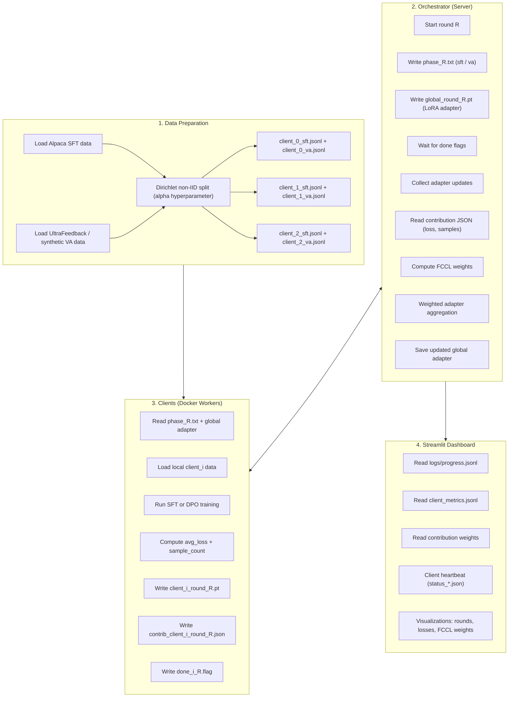

# Federated Learning System for GPT-2 with Cognitive Contribution Learning (FCCL)

A complete, production-style **Federated LLM Training Framework** implementing:

- **Federated Instruction Tuning (FedIT)**
- **Federated Value Alignment (FedVA) via DPO**
- **LoRA-based GPT-2 fine-tuning**
- **Non-IID Dirichlet client datasets**
- **FCCL — Federated Cognitive Contribution Learning**
- **Weighted aggregation of client updates**
- **Docker-based distributed simulation**
- **Real-time monitoring dashboard**
- **Evaluation pipeline (perplexity, preference accuracy, generations)**

This repository simulates a decentralized multi-client environment with realistic data heterogeneity, variable client quality, and contribution-aware aggregation — closely resembling modern *FedLLM* systems used in industry.

---

# 📌 1. What This Project Does

This system fine-tunes GPT-2 collaboratively across multiple clients:

- Each client has a **different non-IID data slice**
- They train locally (LoRA-tuned GPT-2)
- They report their **average loss** and **data size** to the server
- The server aggregates updates using **FCCL (weighted FedAvg)**

FCCL ensures:

- Better-performing clients → higher influence  
- Larger datasets → higher contribution  
- Noisy clients → down-weighted  
- Non-IID imbalance → corrected  

The final output is a **globally fine-tuned GPT-2** enhanced through intelligent contribution-aware aggregation.

---

# 🏗️ 2. System Architecture



---

# 📚 3. Project Structure

```
.
├── client.py          # Client worker: training + contribution logging
├── orchestrator.py    # Server: rounds, aggregation, FCCL logic
├── training.py        # Local training utilities (SFT + DPO)
├── utils.py           # LoRA utilities, scoring, aggregation helpers
├── data_prep.py       # Dirichlet non-IID partitioning
├── evaluate.py        # Perplexity, preference accuracy, generation
├── dashboard.py       # Streamlit UI for monitoring
├── config.py          # Hyperparameters + FCCL config
├── docker-compose.yml # Multi-client simulation setup
├── Dockerfile         # Base client/server container
└── data/clients/      # Generated SFT + VA shards
```

---

# 🧠 4. FCCL — Federated Cognitive Contribution Learning

FCCL enhances FedAvg by weighting each client's contribution.

### **Contribution Score Options**

#### 1. Based on Loss  
Lower loss → higher weight  
`score = 1 / loss`

#### 2. Based on Dataset Size  
More samples → higher weight  
`score = num_samples`

#### 3. Combined  
`score = num_samples / loss`

### **Softmax Weighting**

\[
w_i = \frac{\exp(\text{score}_i / T)}{\sum_j \exp(\text{score}_j / T)}
\]

Where:

- `T` = temperature  
- Lower `T` ⇒ sharper weighting  
- Higher `T` ⇒ smoother weighting  

The final global adapter is aggregated using these weights.

---

# 🔬 5. Local Training: SFT + DPO

### ✔ Instruction Tuning (SFT)
- Learns from instruction → response
- Response-only masking

### ✔ Value Alignment (DPO)
- Uses preferred vs dispreferred responses
- Computes DPO pairwise preference loss
- Improves alignment and helpfulness

Each client logs:

- `avg_loss`
- `num_samples`
- Training time
- LoRA adapter update file

---

# 📊 6. Dashboard (Live Monitoring)

Streamlit UI displays:

- Round progress (SFT + VA)
- Client losses over time
- FCCL weights per round
- Heartbeat for each client
- Exchange dir artifacts (updates, flags, weights)
- Logs from `progress.jsonl` and `client_metrics.jsonl`

Provides real-time observability similar to FedML or Flower dashboards.

---

# ⚙️ 7. Setup & Execution

## Step 1 — Install Dependencies
```bash
pip install -r requirements.txt
```

## Step 2 — Prepare Data
```bash
python data_prep.py
```

## Step 3 — Launch Federated Simulation (Docker)
```bash
docker-compose up --build
```

## Optional: Run Dashboard Manually
```bash
streamlit run dashboard.py
```

## Step 4 — Evaluate Model
```bash
python evaluate.py --sft 50 --va 50 --gen-samples 3 --gen-tokens 30
```

This computes:

- Perplexity (base vs FCCL)
- Preference accuracy
- Generated sample outputs

---

# 🔧 8. Configuration (config.py)

Key settings include:

### Model & LoRA
- `MODEL_NAME`
- `LORA_R`, `LORA_ALPHA`
- `MAX_LENGTH`

### Federated Learning
- `NUM_CLIENTS`
- `CLIENTS_PER_ROUND`
- `FED_ROUNDS`

### Training
- `SFT_LOCAL_EPOCHS`, `SFT_LR`
- `VA_LOCAL_EPOCHS`, `VA_LR`

### Non-IID Split
- `NON_IID_ALPHA`

### FCCL
- `CONTRIBUTION_MODE`
- `CONTRIBUTION_SOURCE`
- `CONTRIBUTION_TEMPERATURE`

---

# 🎯 9. Why This Project Stands Out

- True DPO-based Federated Value Alignment  
- Real LoRA adapter aggregation  
- Weighted update strategy (FCCL)  
- Multi-client distributed simulation  
- High-quality monitoring & observability  
- Modular, production-style architecture  
- Reproducible evaluation pipeline  
- Research-grade implementation  

This is not a toy FL experiment — it is a fully engineered system.

---

# 📄 10. Resume-Ready Summary

> Built a fully modular federated GPT-2 training system using LoRA adapters, non-IID client datasets, DPO-based value alignment, and a novel FCCL weighting algorithm for contribution-aware aggregation. Implemented a multi-client Docker simulation, live monitoring dashboard, and a complete evaluation pipeline.

---

# 🪪 License  
MIT License.
